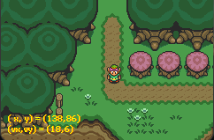
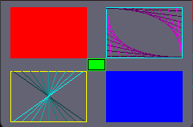
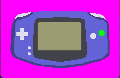
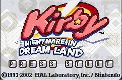
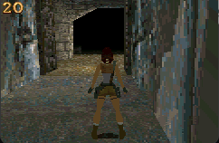

# Game Boy Advance Emulator
This is a WIP Game Boy Advance Emulator.

# Showcase

    
| Mode 0 (Tonc Demo) | Mode 3 (Tonc Demo) | Mode 4 (Tonc Demo) |
|:---:|:---:|:---:|
|  |  |  |
| Kirby Nightmare In Dream Land | Open Lara | Mode 3 (Panda Demo) |
|  |  |  |

## Current Features
- A fully-working ARM7TDMI cpu interpreter, passing the [FUZZARM](https://github.com/DenSinH/FuzzARM) and [ARM Wrestler](https://github.com/mic-/armwrestler) rom tests. 
- A decoupled ARM7TDMI disassembler.
- SDL3 for window and input handling.
- Support for PPU modes 0, 3, and 4.

## Planned Updates
- Work on passing more GBA test roms:
    - Jsmolka's CPU & memory Tests
- Continue working on and completing the PPU:
    - Adding Modes 1, and 2
    - Adding Affine Transformations for sprites
    - Adding post-processing effects (i.e. alpha blending, mosaic)
    - Fixing Mode 5
- Implement Timers
- Implement DMA
- An ImGui-based debugger that allows you to view:
    - CPU GP registers
    - Disassembler showing the program trace
    - Current mode and CPSR
    - Interrupt I/O registers (IE, IF, IME)
    - EWRAM/IWRAM hex dump
- Make/CMake Compilation

## Note
- This emulator requires a BIOS to run. I mostly used [Nebuleon's Open Source BIOS replacement](https://github.com/Nebuleon/ReGBA/tree/master) for my emulator so I'd recommend using that one.

This project is in active development, so stay tuned for updates :)
